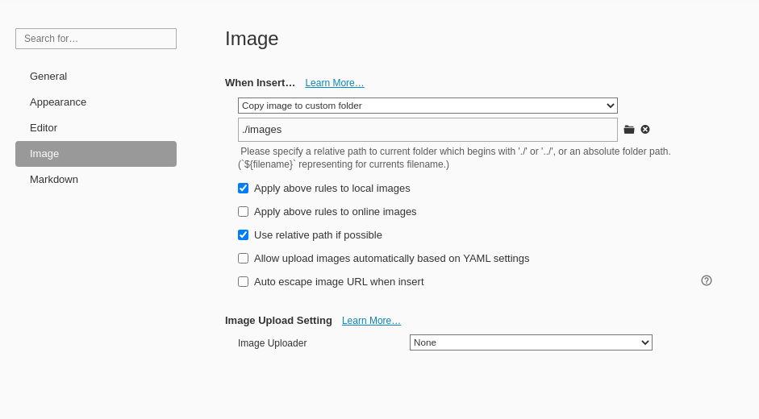
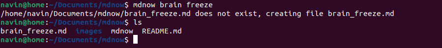

Installation

- need to have typora installed on your computer linux machine. Install it from here: https://typora.io/

- move the file to your bin folder

  - ```bash
    sudo mv mdnow /bin/
    ```


# Usage: 

```bash
mdnow <filename>
```


- Creates a ".md" file with the passed in name.

- Creates a images folder if it doesn't exist,  which stores all the images associated with markdown file. 

  - Make sure to set the custom folder to ./images in the **typora settings**.

    

- Allow for naming files  without worrying about putting a  underscore or having to put the name in double quotes.

  

  